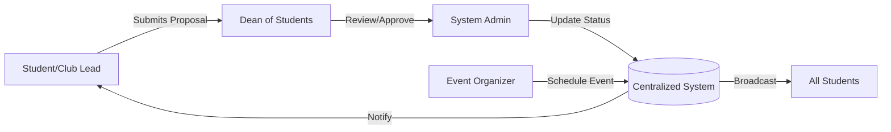
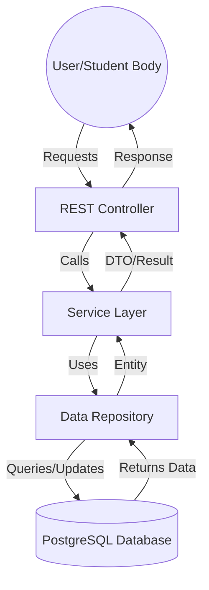
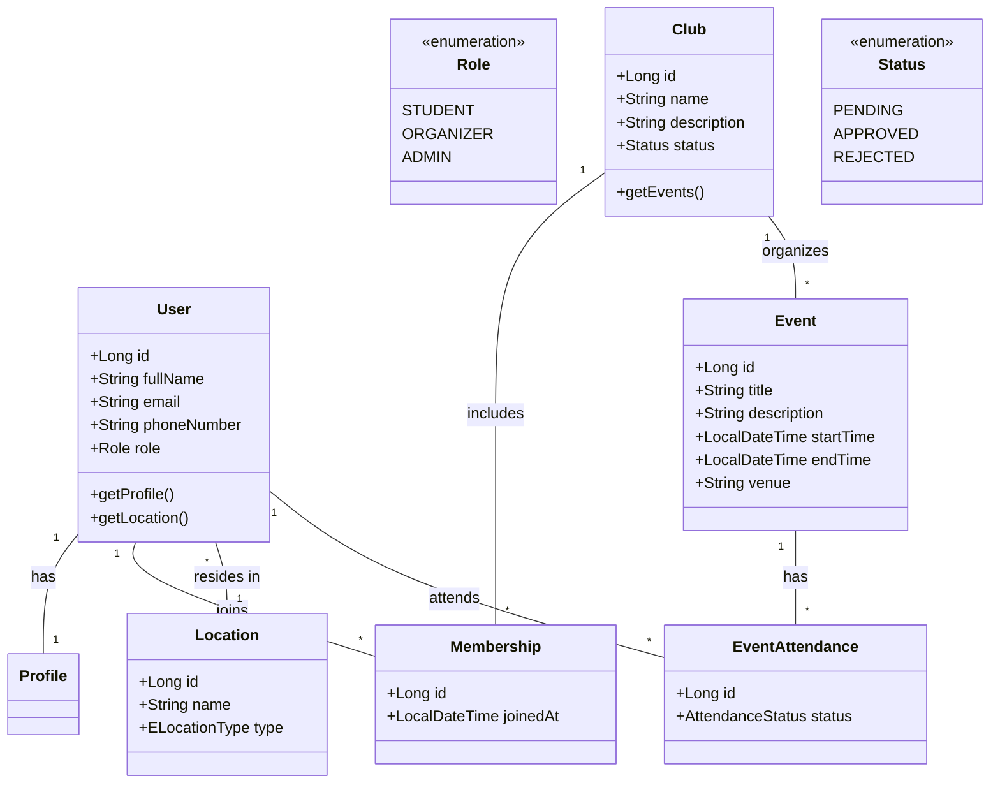
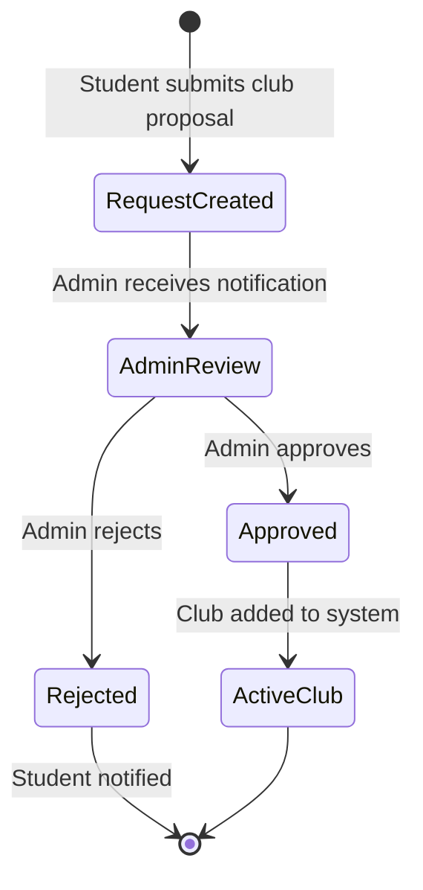
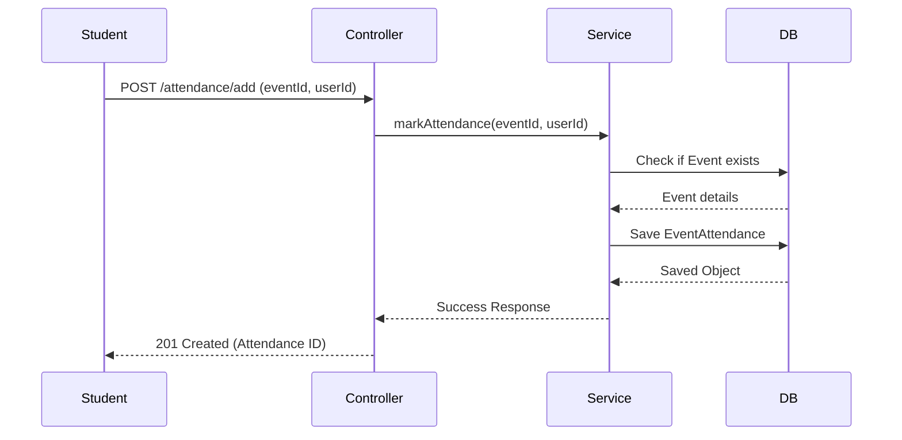

# PHASE 1: SYSTEM ANALYSIS AND DESIGN

## i. Case Study: Adventist University of Central Africa (AUCA)

### General Description
The **Adventist University of Central Africa (AUCA)** is a private Christian university in Rwanda, with its main campus in Masoro and another in Gishushu, Kigali. AUCA offers various undergraduate and postgraduate programs and is known for its strong emphasis on holistic education, including spiritual, social, and academic growth.

Student life at AUCA is vibrant, with numerous clubs (spiritual, academic, and social) and regular campus events. However, managing these activities across multiple campuses presents significant administrative challenges.

### System Analysis
The proposed **Campus Events & Club Management System** aims to centralize and automate the management of student clubs and events at AUCA. It provides a digital platform where students can discover clubs, register for memberships, and stay updated on campus events, while administrators can oversee club approvals and event logistics.

---

## ii. Functional Diagram
This diagram illustrates the internal working of the case study (AUCA) and how the system integrates into the organizational workflow.

### 1. Business Process Flow (AUCA Internal Working)
How activities are managed within the university departments.



### 2. System Architecture Flow
How data flows between the software components.



---

## iii. Problem Statement
AUCA currently faces several challenges in managing student activities:
1.  **Fragmented Communication**: Announcements about club meetings or campus events are often made through physical posters or informal social media groups, leading to missed opportunities for students.
2.  **Manual Processes**: Club registrations and event attendance tracking are largely paper-based or manual, making it difficult to maintain accurate records.
3.  **Cross-Campus Coordination**: With students split between Masoro and Gishushu campuses, coordinating university-wide events and tracking memberships across locations is inefficient.
4.  **Lack of Transparency**: There is no centralized system to track club approval statuses or event history, leading to administrative delays.

---

## iv. Object Oriented System Analysis and Design

### 1. Use Case Diagram
Describes the interactions between users (Actors) and the system.

```mermaid
useCaseDiagram
    actor Student
    actor Organizer
    actor Admin

    package "Campus Events System" {
        usecase "Register/Login" as UC1
        usecase "Join Club" as UC2
        usecase "View Events" as UC3
        usecase "Register for Event" as UC4
        usecase "Create Club" as UC5
        usecase "Create Event" as UC6
        usecase "Approve/Reject Club" as UC7
        usecase "Manage Users" as UC8
        usecase "Post Announcement" as UC9
    }

    Student --> UC1
    Student --> UC2
    Student --> UC3
    Student --> UC4
    Student --> UC5

    Organizer --> UC1
    Organizer --> UC6
    Organizer --> UC9
    Organizer --> UC3

    Admin --> UC1
    Admin --> UC7
    Admin --> UC8
    Admin --> UC9
```

### 2. Class Diagram
Represents the system's static structure, showing classes, attributes, and relationships.



### 3. Activity Diagram
Shows the workflow for creating and approving a new club at AUCA.



### 4. Sequence Diagram
Illustrates the process of a student registering for a campus event.



### 5. Component Diagram
Shows the high-level architecture of the application.

```mermaid
componentDiagram
    [Web Browser (React)] ..> [API Controller] : JSON/HTTP
    package "Spring Boot Application" {
        [API Controller] --> [Business Logic (Service)]
        [Business Logic (Service)] --> [Data Access (Repository)]
    }
    [Data Access (Repository)] ..> [PostgreSQL Database] : JDBC/SQL
```
